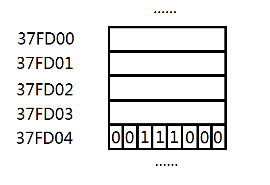

Chap 1.2
==============================
作者：李文新、gtdzx
时间：2015-2-1

变量的定义
--------------
###标识符
首先我们来了解一下**标识符**这个概念。标识符是程序员对程序中的各个元素加以命名时使用的命名记号。这些元素可能是变量、函数、数据类型等。  
例如在上一节我们见到的```main```、```scanf```、```int```、```return```等都是标识符。  
需要注意的是：  
- C语言中合法的标识符是由大小写字母、下划线和数字组成的字符序列，并且第一个字符不能是数字。
- C语言中的标识符是大小写敏感的，a和A是不同的标识符。  

合法的标识符举例: ```a```  ```Aa``` ```c1``` ```x23``` ```y2a``` ```_``` ```_pku_```  
非法的标识符举例: ```1```  ```123``` ```0Ac``` ```a!``` ```@W```  ```-X-```  

###变量的定义
变量的定义包含**数据类型**、**变量名**、**初值**三个部分，其中初值是可选的。例如：
```cpp
int sum = 0;
```
```int``` 是数据类型，表明变量是一个整数类型的变量（简称“整型”）。  
```sum``` 是变量的名字，它必须是一个合法的标识符。  
```=0``` 是把sum变量的初始值设为0。在变量定义时设初始值是好的编程习惯。  

我们可以在一条语句中定义多个数据类型相同的变量。例如：
```cpp
int sum = 0, diff, x = 1;
```

变量与内存
--------------
###内存的抽象
一旦程序开始运行，程序中定义的变量就会存储在内存中。每个变量根据数据类型不同，占用不同大小的内存。  
计算机的内存可以想像成一条长长的带状存储空间。  
  
带中的每一行代表一个基本的存储单元——字节(Byte)。  
每个字节包含8个二进制位——比特(bit)，其中每个比特可以存储0或者1。  
每个字节都被从0开始依次编号，这个编号叫做“地址”。习惯上我们会用一个16进制数来描述一个地址，例如**3FFD00**指的是内存中第3600128个字节。

除了Byte，我们常用的存储单位还有KB、MB(兆)、GB(G)、TB(T)、PB(P)等。它们之间的换算关系如下表所示。  
1KB = 1024Byte  
1MB = 1024KB  
1GB = 1024MB  
1TB = 1024GB  
1PB = 1024TB  
我们可以看出字节相对于现在的计算机内存来说是一个非常小的单位。如果我们的计算机内存是4G大小的话，它可以存储大约40亿个字节的数据。
###变量的存储
当程序运行时，程序中定义的变量会被存储在内存中。例如
```cpp
int sum = 0;
```
操作系统会找到一段没有被使用的内存，把```0```存放到这段内存中，并且把这段内存的初始地址与变量名```sum```关联起来。这段内存的大小与变量的数据类型有关。
###不同数据类型的内存占用
|数据类型|内存占用|
|:------:|:------:|
|int     | 4Byte  |
|short   | 2Byte  |
|long    | 8Byte  |
|long long|8Byte  |
|char    | 1Byte  |
|float   | 4Byte  |
|double  | 8Byte  |
|bool    | 1Byte  |
其中```int```,```short```,```long```,```long long```都是整数类型，它们占用的内存大小不同使得它们能表示的整数范围有差别。  ```float```和```double```都是浮点数类型，它们占用的内存大小不同使得它们能表示的浮点数范围有差别。我们会在下一节详细说明。  

###sizeof函数
C语言中提供了一个非常方便的函数```sizeof```，它可以计算一个数据类型或者变量占用了多少个字节。用法如下：
````cpp
#include<stdio.h>
int main()
{
        int a;
        short b;
        long c;
        long long d;
        char e;
        float f;
        double g;
        bool h;
        printf("%d %d\n", sizeof(int), sizeof(a));
        printf("%d %d\n", sizeof(short), sizeof(b));
        printf("%d %d\n", sizeof(long), sizeof(c));
        printf("%d %d\n", sizeof(long long), sizeof(d));
        printf("%d %d\n", sizeof(char), sizeof(e));
        printf("%d %d\n", sizeof(float), sizeof(f));
        printf("%d %d\n", sizeof(double), sizeof(g));
        printf("%d %d\n", sizeof(bool), sizeof(h));
        return 0;
}
```
输出是：
```
4 4
2 2
8 8
8 8
1 1
4 4
8 8
1 1
```

变量的二进制表示
----------------
###整型的二进制表示
整型分为无符号整型(```unsighed int```)和有符号整型(```signed int```, 我们平时常用的```int```其实就是有符号整型)两种。它们都占用4Byte的内存，32个bit(二进制位)。每一个bit都可能有0和1两种状态，32bit一共有2^32种不同的状态，所以可以表示2^32个不同的整数。但是```singedn int```和```unsigned int```表示的具体范围略有不同。  
```unsighed int```表示的整数范围是0 ~ 2^32-1，也即0 ~ 4294967295。  
```signed int```和```int```表示的范围是-2^31 ~ 2^31-1，也即-2147483648 ~ 2147483647。

对于```unsigned int```，32个bit的状态与对应的整数关系如下表。  

|32bit    |整数|
|:-------:|:--------:|
|1111...11|4294967295|
|1111...10|4294967294|
|    ...  |...       |
|1000...00|2147483648|
|...      |...       |
|0000...01|1         |
|0000...00|0         |

对于```signed int```和```int```，32个bit的状态与对应的整数关系如下表。  

|32bit    |整数|
|:-------:|:--------:|
|111...11|-1        |
|111...10|-2        |
|    ...  |...       |
|1000...00|-2147483648|
|0111...11|2147483647|
|0111...10|2147483646|
|...      |...       |
|0000...01|1         |
|0000...00|0         |
这种二进制与(有符号)十进制直接的对应表示关系叫做**补码表示法**。

变量的赋值与转换
---------------

